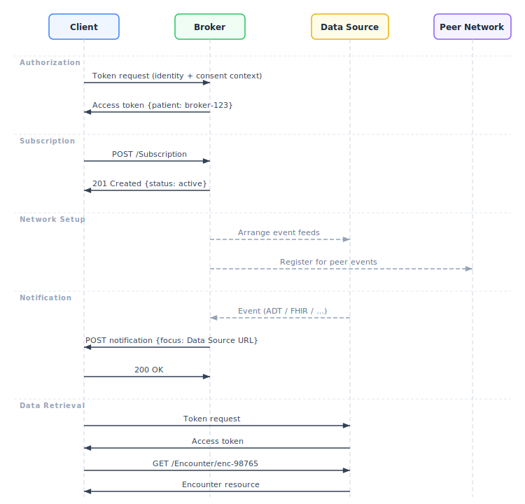
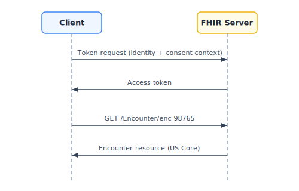

# CMS Aligned Networks: FHIR Subscriptions Broker Architecture

**CMS Interoperability Framework — Subscriptions Workgroup**

*Draft for Discussion*

---

## 1. The Problem

The [CMS Interoperability Framework](https://www.cms.gov/priorities/key-initiatives/interoperability) requires that CMS-Aligned Networks deliver appointment and encounter notifications for outpatient, telehealth, ED, and inpatient encounters using FHIR Subscriptions by July 4, 2026.

Without a brokered approach, an application would need to subscribe for events directly at every data source where a patient might receive care. This is a nonstarter: you can never know in advance every site where a patient might show up — an ED visit, a new specialist, an urgent care clinic while traveling. Even setting aside this fundamental problem, the infrastructure doesn't exist:

- Where FHIR APIs exist, they require provider-portal-specific registration, credentials, and approvals — and rarely support Subscriptions
- Notification capabilities, where they exist, vary widely (HL7v2 ADT, proprietary feeds, polling)

The brokered model solves both problems: the app doesn't need to know where a patient will be seen, and it doesn't need to integrate with each site's technology. The network handles discovery and event routing.

## 2. The Brokered Model

A **Subscriptions Broker** operated by a CMS-Aligned Network solves this by giving applications a single FHIR API surface with network-wide reach:

1. **One connection** — The app creates a subscription at the Broker, not at individual data sources
2. **Network-wide notifications** — The Broker arranges to receive events from all participating data sources and peer networks, then delivers them as standard FHIR notifications
3. **Internal plumbing is invisible** — The Broker handles whatever integration is needed behind the scenes


<details>
<summary>Diagram source (Pikchr)</summary>

```pikchr
scale = 0.85
fontscale = 1.05
down

# ── Client (top center) ─────────────────────────────────────
C: box "Client" bold fit rad 5px fill 0xD6EAF8

# ── Arrow to Broker ──────────────────────────────────────────
arrow down 0.5in "FHIR Subscriptions API" ljust

# ── Broker (wide, center) ───────────────────────────────────
B: box "Subscriptions Broker" bold "(CMS-Aligned Network)" \
   wid 4.0in ht 0.6in rad 5px fill 0xFAD7A0

# ── Peer Network (right of Broker) ──────────────────────────
PN: box "Peer CMS-Aligned" bold "Network / QHIN" \
    fit rad 5px fill 0xE8DAEF \
    with .w at 0.7in right of B.e

arrow dashed <-> from B.e to PN.w

# ── Record Locator Service (left of Broker) ─────────────────
RLS: box "Record Locator" bold "Service" \
     fit rad 5px fill 0xFDEDEC \
     with .e at 0.7in left of B.w

arrow dashed <-> from RLS.e to B.w

# ── Data Sources: fan out from Broker ────────────────────────
DS1: box "EHR / Data Source" bold "(FHIR-native)" \
     fit rad 5px fill 0xD5F5E3 \
     with .n at 1.4in below B.s + (-1.6in, 0)

DS2: box "EHR / Data Source" bold "(ADT feed)" \
     fit rad 5px fill 0xD5F5E3 \
     with .n at 1.4in below B.s

DS3: box "EHR / Data Source" bold "(Legacy / Poll)" \
     fit rad 5px fill 0xD5F5E3 \
     with .n at 1.4in below B.s + (1.6in, 0)

# Fan-out arrows with Manhattan routing
arrow dashed from B.s down 0.15in then left until even with DS1 then to DS1.n
arrow dashed from B.s down 0.15in then to DS2.n
arrow dashed from B.s down 0.15in then right until even with DS3 then to DS3.n

# Labels beside each vertical leg
text "FHIR" small with .e at DS1.n + (-0.08in, 0.15in)
text "Subscriptions" small with .e at DS1.n + (-0.08in, 0.32in)

text "HL7v2 ADT" small with .w at DS2.n + (0.08in, 0.2in)

text "Polling /" small with .w at DS3.n + (0.08in, 0.15in)
text "Proprietary" small with .w at DS3.n + (0.08in, 0.32in)

# ── Abstraction boundary (between arrows and data sources) ──
AB: line dashed from RLS.sw + (0, -0.45in) \
  right until even with PN.se + (0, -0.45in) color gray
text "network-internal plumbing (opaque to Client)" italic color gray \
  with .n at 0.06in below AB.c
```

</details>

### 2.1 What the Broker Abstracts Away

The Client sees a standard FHIR Subscriptions API. Behind it, the Broker may:

- Create FHIR Subscriptions at Data Sources that support them natively
- Configure HL7v2 ADT routing from Data Sources that use ADT feeds
- Poll Data Sources that don't support push
- Query a Record Locator Service (RLS) to discover relevant Data Sources
- Register for events from peer CMS-Aligned Networks or TEFCA QHINs
- Convert events from HL7v2, CCDA, or proprietary formats into FHIR notifications

None of this is visible to the Client. The Client creates a FHIR Subscription, receives FHIR notification bundles, and retrieves FHIR resources.

### 2.2 Roles

| Actor | Description |
|-------|-------------|
| **Client** | Application that creates subscriptions and receives notifications (patient-facing IAS apps, provider apps, care management platforms) |
| **Broker** | CMS-Aligned Network component that manages subscriptions, aggregates events, and delivers notifications |
| **Data Source** | System that holds patient data and produces events (provider EHRs, payers) |

### 2.3 Relationship to Other Specifications

| Specification | Relationship |
|---------------|--------------|
| [US Core Patient Data Feed](http://hl7.org/fhir/us/core/patient-data-feed.html) | This architecture uses the Patient Data Feed topic and extends it for brokered scenarios |
| [FHIR R4 Subscriptions Backport](http://hl7.org/fhir/uv/subscriptions-backport/) | Subscription resource structure and notification bundle format |
| [SMART Backend Services](http://hl7.org/fhir/smart-app-launch/backend-services.html) | Basis for B2B authorization pattern |
| TEFCA / QHIN Requirements | Network trust model; Brokers may be QHINs or other CMS-Aligned Networks |

### 2.4 Trust and Privacy Model

The Broker operates within the same network trust framework that CMS-Aligned Networks already use for services like Record Locator Services — it does not expand the categories of PHI the network handles or the legal basis under which it operates. See the [FAQ](faq.md) for details on trust, patient matching, and notification privacy.

---

## 3. Patient Identity in the Brokered Model

Patients do not have a single stable identifier across organizations or networks. The brokered model does not require one.

Instead:

1. The Client presents **IAL2-verified identity attributes** (e.g., demographic data from a trusted identity provider like CLEAR or ID.me) when requesting an access token from the Broker
2. The Broker returns a **broker-scoped `Patient.id`** in the access token response (using the SMART on FHIR `patient` parameter)
3. The Client uses this `Patient.id` in subscription filter criteria

This `Patient.id` is meaningful only at the Broker — it is not a cross-organization identifier. How the Broker resolves identity — including when and how patient matching occurs for incoming events — is a network-internal concern (see [FAQ](faq.md#what-about-patient-matching-ehrs-manage-their-own-matching-thresholds-today) for discussion of matching approaches). The Client never needs to know how patients are identified at individual Data Sources.

---

## 4. Authorization

### 4.1 Identity Requirements

Per CMS Framework Criteria V, all access requires IAL2/AAL2-verified identity. The Client coordinates identity proofing through a [Kantara-certified](https://kantarainitiative.org/trust-status-list/) identity service at IAL2 (e.g., CLEAR, ID.me) out-of-band, then presents the resulting credentials when requesting access tokens.

### 4.2 Authorization Context

Access tokens are obtained in the context of verified:

1. **Who** — The verified identity (patient, provider, or delegate)
2. **What** — The permitted scope of access
3. **Why** — The purpose (individual access, treatment, payment, operations)
4. **Consent** — Evidence that disclosure is authorized (see [Section 4.3](#43-consent-and-authorization-pilot-vs-at-scale) for how consent scope evolves from pilot to production)

The authorization flow follows a Backend Services-style pattern: the Client presents credentials in a token request and receives a token without user interaction — identity proofing and consent have already occurred out-of-band.

### 4.3 Consent and Authorization: Pilot vs. At Scale

For an **initial pilot**, implicit authorization may be sufficient — for example, assuming that a patient who has completed IAL2 identity proofing and installed an IAS app has consented to receive their own data.

This **will not scale** to scenarios that require explicit, granular consent:

- Designated representatives acting on behalf of a patient
- Caregivers with partial access rights
- Minors and guardians with age-dependent rules
- Substance use disorder or behavioral health data with 42 CFR Part 2 restrictions

These scenarios require a standardized mechanism for conveying consent context alongside identity in token requests. The [Argonaut Project](https://confluence.hl7.org/spaces/AP/pages/86969961/Argonaut+Project+Home) is considering a 2026 initiative on **"SMART Permission Tickets"** that could provide a technical basis for this — encoding identity, consent, and purpose of use into a verifiable token that can propagate from Broker to Data Source. The CMS Patient Preferences and Consent Workgroup is also exploring how consent information should be conveyed in network transactions.

The specific format for authorization requests is **out of scope for this document** but must be pinned down for production use.

### 4.4 Token Response

The Broker's token response follows [SMART on FHIR](http://hl7.org/fhir/smart-app-launch/) conventions, including a `patient` parameter that gives the Client the broker-scoped `Patient.id` to use in subsequent requests:

```js
{
  "access_token": "eyJ...",
  "token_type": "bearer",
  "expires_in": 3600,
  "scope": "system/Subscription.crud",
  "patient": "broker-123"  // Broker-scoped Patient.id for use in filters
}
```

The Client uses this `patient` value when constructing subscription filter criteria — it never needs to know or supply a cross-organization patient identifier.

---

## 5. Protocol Flow



<details>
<summary>Diagram source (Pikchr)</summary>

```pikchr
leftmargin = 0.1in
rightmargin = 0.1in
down

# ── Actor boxes ─────────────────────────────────────────────
CL: box "Client" bold width 1.1in height 0.4in \
    fill 0xD6EAF8 rad 0.06in
BK: box "Broker" bold width 1.1in height 0.4in \
    fill 0xFAD7A0 rad 0.06in \
    with .w at 1.9in right of CL.e
DS: box "Data Source" bold width 1.1in height 0.4in \
    fill 0xD5F5E3 rad 0.06in \
    with .w at 1.9in right of BK.e

# ── Lifelines ───────────────────────────────────────────────
LCL: line from CL.s down 7.5in dashed color gray
LBK: line from BK.s down 7.5in dashed color gray
LDS: line from DS.s down 7.5in dashed color gray

# ── Phase 1: Authorization ──────────────────────────────────
move to CL.s; move down 0.25in
text "① Authorization" bold color 0x8E44AD \
  with .w at last move.end

move to CL.s; move down 0.6in
arrow right until even with BK.s thick color 0x8E44AD \
  "Token request (identity + consent)" above

move to BK.s; move down 1.1in
arrow left until even with CL.s dashed thick color 0x8E44AD \
  "{ access_token, patient: \"broker-123\" }" above

# ── Phase 2: Subscribe ─────────────────────────────────────
move to CL.s; move down 1.7in
text "② Subscribe" bold color 0x2E86C1 \
  with .w at last move.end

move to CL.s; move down 2.05in
arrow right until even with BK.s thick color 0x2E86C1 \
  "POST /Subscription  (patient=broker-123)" above

# Broker activation
move to BK.s; move down 2.05in
BSUB: box width 0.15in height 0.7in fill 0xFAD7A0 color 0xFAD7A0 \
  with .n at last move.end

move to BK.s; move down 2.45in
text "status:" italic \
  with .w at 0.2in right of last move.end
text "requested → active" bold \
  with .w at 0.05in right of last text.e

# Broker sets up internal feeds
move to BK.s; move down 2.75in
arrow right until even with DS.s dashed color gray \
  "Arrange feeds (internal)" above italic

# ── Phase 3: Event & Notification ───────────────────────────
move to DS.s; move down 3.8in
text "③ Event" bold color 0x27AE60 \
  with .e at 0.15in left of last move.end

move to DS.s; move down 4.15in
E3: dot color 0x27AE60 rad 0.04in
text "Encounter created" italic color 0x27AE60 \
  with .w at 0.15in right of E3.e

arrow from E3 left until even with BK.s thick color 0x27AE60 \
  "Event (ADT / FHIR)" above

move to BK.s; move down 4.15in
BA2: box width 0.15in height 0.5in fill 0xFAD7A0 color 0xFAD7A0 \
  with .n at last move.end

move to BK.s; move down 4.65in
arrow left until even with CL.s thick color 0x2E86C1 \
  "POST notification Bundle" above

# ── Phase 4: Data Retrieval ─────────────────────────────────
move to CL.s; move down 5.3in
text "④ Retrieve" bold color 0x2E86C1 \
  with .w at last move.end

move to CL.s; move down 5.65in
arrow right until even with DS.s thick color 0x2E86C1 \
  "GET /Encounter/enc-98765  (after auth)" above

move to DS.s; move down 6.15in
arrow left until even with CL.s dashed thick color 0x2E86C1 \
  "Encounter resource (US Core)" above
```

</details>

### 5.1 Creating a Subscription

**Client → Broker**

```http
POST https://broker.example.org/fhir/Subscription
Authorization: Bearer {access_token}
Content-Type: application/fhir+json
```

```js
{
  "resourceType": "Subscription",
  "status": "requested",
  "reason": "Monitor patient encounters across network",

  // Topic: US Core Patient Data Feed
  "criteria": "http://hl7.org/fhir/us/core/SubscriptionTopic/patient-data-feed",
  "_criteria": {
    "extension": [{
      "url": "http://hl7.org/fhir/uv/subscriptions-backport/StructureDefinition/backport-filter-criteria",
      // Filter to encounters for this patient (broker-scoped id from token response)
      "valueString": "Encounter?patient=Patient/broker-123&trigger=feed-event"
    }]
  },

  "channel": {
    "type": "rest-hook",
    // Where the Broker should POST notifications
    "endpoint": "https://client.example.org/fhir/notifications",
    "payload": "application/fhir+json",
    "_payload": {
      "extension": [{
        "url": "http://hl7.org/fhir/uv/subscriptions-backport/StructureDefinition/backport-payload-content",
        // Notification includes references only — Client fetches full resources separately
        "valueCode": "id-only"
      }]
    }
  }
}
```

**Key points:**

- `patient=Patient/broker-123` uses the **broker-assigned `Patient.id`** from the token response — not a cross-organization identifier
- The `trigger=feed-event` filter uses the US Core Patient Data Feed topic's trigger definition
- `id-only` payload means notifications contain references, not inline resources

### 5.2 Broker Processes the Subscription (Internal)

What happens inside the network is opaque to the Client. The Broker arranges to receive relevant events from Data Sources using whatever mechanisms are available — FHIR Subscriptions, HL7v2 ADT feeds, polling, peer network queries. The Client sees only the `Subscription` resource (with status updates) and the notifications that follow.

| Status | Meaning |
|--------|---------|
| `requested` | Client has requested; Broker is setting up |
| `active` | Subscription is live; notifications will be delivered |
| `error` | Problem occurred (details in `error` element) |
| `off` | Subscription is disabled |

### 5.3 Event Occurs and Notification Is Delivered

**Broker → Client**

When a matching event occurs at any Data Source in the network (or a peer network), the Broker delivers a FHIR notification bundle:


<details>
<summary>Diagram source (Pikchr)</summary>

```pikchr
# Sequence-diagram style: three lifelines
leftmargin = 0.2in
rightmargin = 0.2in
down

# ── Actor boxes ─────────────────────────────────────────────
DS: box "Data Source" bold width 1.3in height 0.45in \
    fill 0xD5F5E3 rad 0.06in
move to DS.e; right
BK: box "Broker" bold width 1.3in height 0.45in \
    fill 0xFAD7A0 rad 0.06in \
    with .w at 2.0in right of DS.e
move to BK.e; right
CL: box "Client" bold width 1.3in height 0.45in \
    fill 0xD6EAF8 rad 0.06in \
    with .w at 2.0in right of BK.e

# ── Lifelines ───────────────────────────────────────────────
LDS: line from DS.s down 3.2in dashed color gray
LBK: line from BK.s down 3.2in dashed color gray
LCL: line from CL.s down 3.2in dashed color gray

# ── Step 1: Event at Data Source ────────────────────────────
move to DS.s; move down 0.4in
E1: dot color 0x27AE60 rad 0.04in
text "Patient admitted" italic color 0x27AE60 with .w at 0.15in left of E1.w

# ── Step 2: DS notifies Broker (internal) ───────────────────
move to E1; move down 0.25in
A1S: dot invisible
move to BK.s; move down 0.65in
A1E: dot invisible
arrow from A1S to A1E thick color 0x27AE60
text "ADT / FHIR / feed" above italic color gray \
  with .w at 0.1in right of A1S.e

# Activation box on Broker
move to A1E; move down 0.0in
BACT: box width 0.15in height 0.8in fill 0xFAD7A0 color 0xFAD7A0 \
  with .n at A1E

# ── Step 3: Broker matches patient ──────────────────────────
move to BACT.w; move left 0.1in; move down 0.05in
text "Match patient" italic color gray \
  with .e at last move.end
text "Build notification" italic color gray \
  with .ne at 0.0in below last text.se

# ── Step 4: Broker delivers notification to Client ─────────
move to BK.s; move down 1.45in
A2S: dot invisible
move to CL.s; move down 1.45in
A2E: dot invisible
arrow from A2S to A2E thick color 0x2E86C1 \
  "POST /notifications" above

# Activation box on Client
move to A2E
CACT: box width 0.15in height 0.5in fill 0xD6EAF8 color 0xD6EAF8 \
  with .n at A2E

# ── Step 5: Notification bundle label ───────────────────────
move to CACT.e; move right 0.1in
text "FHIR" bold with .w at last move.end
text "subscription-notification" italic \
  with .nw at 0.0in below last text.sw
text "Bundle" italic \
  with .nw at 0.0in below last text.sw

# ── Step 6: Client returns 200 OK ──────────────────────────
move to CL.s; move down 2.25in
R1S: dot invisible
move to BK.s; move down 2.25in
R1E: dot invisible
arrow from R1S to R1E dashed color 0x2E86C1 "200 OK" below
```

</details>

```js
{
  "resourceType": "Bundle",
  "type": "subscription-notification",
  "timestamp": "2026-03-15T14:32:00Z",
  "entry": [{
    "fullUrl": "urn:uuid:notification-status-1",
    "resource": {
      "resourceType": "SubscriptionStatus",
      "status": "active",
      "type": "event-notification",
      "eventsSinceSubscriptionStart": 1,
      "notificationEvent": [{
        "eventNumber": 1,
        "timestamp": "2026-03-15T14:30:15Z",
        "focus": {
          // Absolute URL tells the Client where to fetch this resource.
          // Here it points to the Data Source — but could equally be a Broker URL if the Broker proxies data.
          "reference": "https://mercy-hospital.example.org/fhir/Encounter/enc-98765",
          "type": "Encounter"
        }
      }],
      // Points back to the Broker where the Client created the Subscription
      "subscription": {
        "reference": "https://broker.example.org/fhir/Subscription/sub-abc123"
      },
      "topic": "http://hl7.org/fhir/us/core/SubscriptionTopic/patient-data-feed"
    }
  }]
}
```

**Key points:**

- `focus.reference` is an **absolute URL** — the Client uses this to determine where to fetch the resource
- `subscription.reference` points to the Broker (where the Client created it)
- `eventNumber` allows the Client to detect missed notifications

### 5.4 Client Retrieves Data

The `focus.reference` URL tells the Client where to retrieve the resource:

| URL Base | Meaning | Client Action |
|----------|---------|---------------|
| Broker's endpoint | Broker is proxying/caching the data | Fetch from Broker (already authenticated) |
| Data Source's endpoint | Data lives at source | Connect to Data Source, authenticate, fetch |

The Client follows the `focus.reference` URL — which may point to the Broker or to a Data Source. Either way, the Client uses the same Backend Services-style authorization pattern to obtain an access token without user interaction.



<details>
<summary>Diagram source (Pikchr)</summary>

```pikchr
leftmargin = 0.2in
rightmargin = 0.2in
down

# ── Actor boxes ─────────────────────────────────────────────
CL: box "Client" bold width 1.3in height 0.45in \
    fill 0xD6EAF8 rad 0.06in
move to CL.e; right
DS: box "FHIR Server" bold "(Broker or Data Source)" \
    width 1.7in height 0.55in \
    fill 0xD5F5E3 rad 0.06in \
    with .w at 2.8in right of CL.e

# ── Lifelines ───────────────────────────────────────────────
LCL: line from CL.s down 4.5in dashed color gray
LDS: line from DS.s down 4.5in dashed color gray

# ── Note: focus.reference from notification ─────────────────
move to CL.s; move down 0.3in
text "follow focus.reference URL →" italic color gray \
  with .e at 0.15in left of last move.end

# ── Step 1: Token Request ──────────────────────────────────
move to CL.s; move down 0.9in
T1S: dot invisible
move to DS.s; move down 0.9in
T1E: dot invisible
arrow from T1S.e to T1E.w thick color 0x8E44AD
text "Token request" above italic \
  with .c at 0.5 <T1S, T1E>
text "(identity + consent credentials)" below italic color gray \
  with .c at 0.5 <T1S, T1E>

# ── Step 2: Access Token Response ───────────────────────────
move to DS.s; move down 1.45in
T2S: dot invisible
move to CL.s; move down 1.45in
T2E: dot invisible
arrow from T2S.w to T2E.e dashed thick color 0x8E44AD
text "Access token" above italic \
  with .c at 0.5 <T2S, T2E>

# ── Step 3: GET Encounter ──────────────────────────────────
move to CL.s; move down 2.1in
G1S: dot invisible
move to DS.s; move down 2.1in
G1E: dot invisible
arrow from G1S.e to G1E.w thick color 0x2E86C1
text "GET /Encounter/enc-98765" above italic \
  with .c at 0.5 <G1S, G1E>
text "Authorization: Bearer {token}" below italic color gray \
  with .c at 0.5 <G1S, G1E>

# Activation box on FHIR Server
move to G1E
DSACT: box width 0.15in height 0.6in fill 0xD5F5E3 color 0xD5F5E3 \
  with .n at G1E

# ── Step 4: Encounter Resource Response ─────────────────────
move to DS.s; move down 3.0in
R1S: dot invisible
move to CL.s; move down 3.0in
R1E: dot invisible
arrow from R1S.w to R1E.e dashed thick color 0x2E86C1
text "Encounter resource (US Core)" above italic \
  with .c at 0.5 <R1S, R1E>

# ── Note on Client side ────────────────────────────────────
move to CL.s; move down 3.5in
text "Client renders encounter" italic color gray \
  with .e at 0.15in left of last move.end
text "data for user" italic color gray \
  with .ne at 0.0in below last text.se
```

</details>

Clients MUST be prepared for `focus.reference` pointing to either the Broker or a Data Source.

### 5.5 Summary: What's Specified vs. Internal

| Step | Specified or Internal | Notes |
|------|----------------------|-------|
| Token request to Broker | **Specified** (format TBD) | Backend Services-style with identity + consent |
| Subscription creation | **Specified** | FHIR Subscription resource |
| Broker arranges event feeds | **Internal** | Network-specific (FHIR, HL7v2, polling, etc.) |
| Data Source event production | **Internal** | ADT, FHIR, or other |
| Notification delivery | **Specified** | FHIR subscription-notification Bundle |
| Token request to Data Source | **Specified** (format TBD) | Same Backend Services-style pattern |
| Data retrieval | **Specified** | FHIR RESTful read |

---

## 6. Open Questions

1. **Authorization and consent mechanisms:** How does a Client present identity and consent credentials in a token request — and how does this context propagate to Data Sources? Implicit consent may suffice for initial pilots but will not scale to designated representatives, partial access rights, or sensitive data categories. The SMART Permission Tickets initiative and CMS Patient Preferences and Consent Workgroup are exploring standardized approaches.

---

## References

- [CMS Interoperability Framework](https://www.cms.gov/priorities/key-initiatives/interoperability)
- [US Core Patient Data Feed](http://hl7.org/fhir/us/core/patient-data-feed.html)
- [FHIR R4 Subscriptions Backport IG](http://hl7.org/fhir/uv/subscriptions-backport/)
- [SMART Backend Services](http://hl7.org/fhir/smart-app-launch/backend-services.html)
- [SMART on FHIR](http://hl7.org/fhir/smart-app-launch/)
- [Kantara Trust Status List](https://kantarainitiative.org/trust-status-list/)
