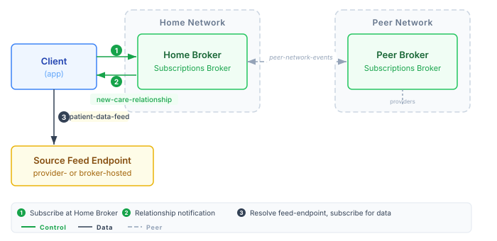
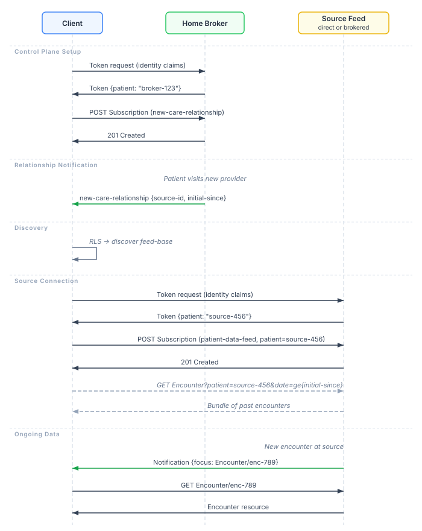

# Relationship Feed + Source Feed Endpoints

**Status:** Draft

## 1. Overview



> **Example cast** — used throughout this document:
>
> | Name | Role | Feed endpoint |
> |------|------|---------------|
> | **HealthApp** | Client application | — |
> | **AZ Health Net Broker** | Home Broker | `broker.az-health.example.org/fhir` |
> | **SW Care Broker** | Peer Broker | `broker.sw-care.example.org/fhir` |
> | **Valley Clinic** | Provider in SW Care; hosts own FHIR feed | `valley-clinic.example.org/fhir` |
> | **Mercy Hospital Phoenix** | Provider in SW Care; no FHIR capability | `broker.sw-care.example.org/fhir/sources/mercy-phoenix` (hosted by SW Care Broker) |
>
> Valley Clinic hosts its own subscribable FHIR endpoint. Mercy Hospital Phoenix cannot, so the SW Care Broker hosts a `feed-endpoint` on its behalf. In both cases, the client does the same thing: authorize, subscribe, receive notifications.

A client subscribes once at its home Broker to learn about new sources of care data. When notified, the client discovers the source through the network's existing RLS, selects source-specific `patient-data-feed` endpoints, and subscribes there for ongoing encounter and appointment data. Whether the source feed endpoint is provider-operated or broker-hosted, the client does the same thing. Peer Brokers signal each other about watched patients across network boundaries, multiplexing many local interests behind one peer subscription so cross-network signaling scales without per-client fan-out.

### 1.1 Three planes

| Plane | Purpose | Surface |
|-------|---------|---------|
| **Control** | Signal that a new source is relevant | Home Broker → Client |
| **Data** | Ongoing encounter and appointment feed | Source feed endpoint → Client |
| **Peer** | Cross-network relationship signaling | Broker ↔ Broker |

### 1.2 End-to-end flow



1. Client authorizes at its Home Broker. The token response includes a broker-scoped `patient` context.
2. Client creates a `new-care-relationship` subscription at the Home Broker, filtered to that patient.
3. The Home Broker ensures it has peer subscriptions with all relevant peer Brokers (§5.1), attaching an authority for this patient on each (§5.3). If peer subscriptions already exist, the Home Broker multiplexes onto them.
4. A patient visits a provider. The provider's network detects the new care relationship internally (ADT, FHIR event, polling — mechanism is network-internal).
5. If the provider is in the Home Network, the Home Broker learns about it directly. If the provider is in a peer network, the peer Broker signals the Home Broker via the `peer-network-events` subscription (§5.5).
6. Home Broker sends the client a `new-care-relationship` notification. The notification may include the `feed-endpoint` and correlation fields (`source-id`, `network-id`).
7. If the notification included `feed-endpoint`, the client can proceed directly. Otherwise, the client uses the network's existing RLS or documented source lookup to discover the `feed-endpoint`.
8. Client authorizes at the source feed endpoint. The token response includes a source-scoped `patient` context.
9. Client creates a `patient-data-feed` subscription at the source feed endpoint, filtered to that patient.
10. Client performs a catch-up query using its own lookback window to pick up the triggering encounter and any other recent activity.
11. All subsequent encounters and appointments at that source arrive via the subscription. The Home Broker is not in the data path.

---

## 2. Terms

**Home Broker.** The Broker where the client has its relationship subscription. It notifies the client when new sources become relevant. It may learn about sources locally or from peer Brokers. It is not necessarily where ongoing clinical data is read.

**Source.** A real care source the client may choose to follow. Identified minimally by stable identifiers. Richer detail (organization name, practitioner roles, etc.) comes from RLS, not from the notification.

**Source feed endpoint (`feed-endpoint`).** A FHIR base URL that supports the minimal data-plane contract defined in this spec (§4.5). May be provided directly in the relationship notification, or discovered via the network's out-of-band RLS. It may be hosted by the provider itself or by the provider's network Broker on the provider's behalf. The client does the same thing in both cases.

**Subject handle.** (Peer model.) A caller-assigned identifier for a patient on a peer link. The broker that calls `$attach-authority` creates the handle and supplies it with each attachment. The sending peer echoes it in notifications so the receiver can route events to the right local patient without per-authority lookup. Multiple authorities for the same patient use the same handle.

**Authority attachment.** (Peer model.) One local reason for keeping a subject active on a peer link. Each has a stable identifier.

---

## 3. Topics

| Topic | Plane | Delivered by | Delivered to | Focus | Content | Purpose |
|-------|-------|-------------|-------------|-------|---------|---------|
| `https://cms.gov/fhir/SubscriptionTopic/new-care-relationship` | Control | Home Broker | Client | `Parameters` | `full-resource` | Signal that a new source is relevant |
| `http://hl7.org/fhir/us/core/SubscriptionTopic/patient-data-feed` | Data | Source feed endpoint | Client | `Encounter` or `Appointment` | `id-only` | Ongoing encounter and appointment notifications |
| `https://cms.gov/fhir/SubscriptionTopic/peer-network-events` | Peer | Peer Broker | Peer Broker | `Parameters` | `full-resource` | Cross-network relationship signaling |

**Filter parameters:**

| Topic | Filter | Value | Notes |
|-------|--------|-------|-------|
| `new-care-relationship` | `patient` | Broker-scoped patient id from token response | Required |
| `patient-data-feed` | `patient` | Source-scoped patient id from token response | Required; applied per resource type (`Encounter?patient=`, `Appointment?patient=`) |
| `peer-network-events` | — | — | No filters; multiplexed across all watched subjects |

The `patient-data-feed` topic uses the US Core canonical URI. This spec constrains it to `Encounter` and `Appointment` for the network use case; see §4.5 for details on Appointment support.

---

## 4. Client-Facing Model

### 4.1 Authorization and patient identity

Patient identity is resolved during authorization at every endpoint. The token response includes the patient context the client uses at that endpoint.

- At the Home Broker, the token response includes a broker-scoped patient id (e.g., `"patient": "broker-123"`). The client uses this in its `new-care-relationship` subscription filter.
- At a source feed endpoint, the token response includes a source-scoped patient id (e.g., `"patient": "source-456"`). The client uses this in its `patient-data-feed` subscription filter.

In both cases the token returns a bare resource id, not a relative reference. This is standard SMART on FHIR behavior — the `patient` parameter in the token response is a bare id. No separate patient-resolution API is needed.

### 4.2 Home Broker subscription

The subscription follows the [Subscriptions R5 Backport IG](http://hl7.org/fhir/uv/subscriptions-backport/) format, filtered to the patient id from the token response (`broker-123`):

```json
{
  "resourceType": "Subscription",
  "status": "requested",
  "reason": "Notify on new care relationships",
  "criteria": "https://cms.gov/fhir/SubscriptionTopic/new-care-relationship",
  "_criteria": {
    "extension": [
      {
        "url": "http://hl7.org/fhir/uv/subscriptions-backport/StructureDefinition/backport-filter-criteria",
        "valueString": "Parameters?patient=broker-123"
      }
    ]
  },
  "channel": {
    "type": "rest-hook",
    "endpoint": "https://app.example.org/fhir/notifications",
    "payload": "application/fhir+json",
    "_payload": {
      "extension": [
        {
          "url": "http://hl7.org/fhir/uv/subscriptions-backport/StructureDefinition/backport-payload-content",
          "valueCode": "full-resource"
        }
      ]
    }
  }
}
```

### 4.3 Relationship notification

When a new source becomes relevant for the patient, the Home Broker sends a notification. The focus is a `Parameters` resource carrying whichever fields the broker has. This example shows a rich notification that includes `feed-endpoint`, allowing the client to skip discovery:

```json
{
  "resourceType": "Bundle",
  "type": "subscription-notification",
  "timestamp": "2026-03-23T15:20:00Z",
  "entry": [
    {
      "fullUrl": "urn:uuid:status-1",
      "resource": {
        "resourceType": "SubscriptionStatus",
        "status": "active",
        "type": "event-notification",
        "eventsSinceSubscriptionStart": 7,
        "notificationEvent": [
          {
            "eventNumber": 7,
            "timestamp": "2026-03-23T15:19:45Z",
            "focus": {
              "reference": "urn:uuid:params-1",
              "type": "Parameters"
            }
          }
        ],
        "subscription": {
          "reference": "https://broker.az-health.example.org/fhir/Subscription/sub-rel-1"
        },
        "topic": "https://cms.gov/fhir/SubscriptionTopic/new-care-relationship"
      }
    },
    {
      "fullUrl": "urn:uuid:params-1",
      "resource": {
        "resourceType": "Parameters",
        "parameter": [
          {
            "name": "source-id",
            "valueIdentifier": {
              "system": "https://cms.gov/fhir/sid/source-id",
              "value": "urn:example:source:mercy-phoenix"
            }
          },
          {
            "name": "network-id",
            "valueIdentifier": {
              "system": "https://cms.gov/fhir/sid/network-id",
              "value": "urn:example:network:sw-care"
            }
          },
          {
            "name": "feed-endpoint",
            "valueUrl": "https://broker.sw-care.example.org/fhir/sources/mercy-phoenix"
          }
        ]
      }
    }
  ]
}
```

**Notification fields:**

All fields are optional. The broker includes what it has. A richer notification lets the client act without a separate discovery step; a thinner notification means "re-run discovery for this patient."

| Field | Purpose |
|-------|---------|
| `source-id` | Stable source key. Correlates to the network's RLS output so the client can match this event to a discovered source. |
| `network-id` | Stable network key. Used with `source-id` for cross-network correlation. |
| `feed-endpoint` | The FHIR base URL where the client subscribes for `patient-data-feed`. If included, the client can skip discovery and go straight to authorization + subscription. |
| `source-fhir-base` | The provider's native FHIR API, if one exists. May support reads/search but is not required to support subscriptions. When absent, there is no separate provider API. When equal to `feed-endpoint`, the provider hosts its own feed. |

**Rules:**

- A Home Broker SHOULD include `feed-endpoint` when known, so the client can act without a separate discovery step.
- When `feed-endpoint` is not available, the Home Broker SHOULD include `source-id` and `network-id` so the client can correlate the event to a discovered source.
- A notification with no fields beyond the subscription envelope is valid as an escape hatch — it means "discovery changed for this patient" — but SHOULD NOT be the default.
- If `source-id` and `network-id` are included, they SHALL correlate correctly to the network's existing RLS output.
- If `feed-endpoint` is included, it SHALL be a valid, subscribable source feed endpoint for the indicated source.
- The notification is not a full RLS payload. It SHALL NOT require the network to inline complete `Organization` or `Endpoint` resources.

### 4.4 Discovery

If the notification does not include `feed-endpoint`, the client needs to discover it. This spec does not standardize the discovery mechanism — it is an out-of-band concern. The network's documented approach may be an existing RLS, a network-specific source directory, or another documented lookup.

The requirements are:

- The network SHALL document a path from relationship notification to `feed-endpoint`.
- If the notification includes `source-id` and `network-id`, the network's discovery mechanism SHALL use the same identifiers so the client can correlate.

### 4.5 Source feed endpoint contract

Every source feed endpoint SHALL support:

- Token-authenticated FHIR requests
- `Subscription` create, read, and delete for the `patient-data-feed` topic
- `id-only` notifications with absolute `Encounter` and `Appointment` URLs
- `read` on `Encounter` and `Appointment`
- Catch-up search over `Encounter` and `Appointment` for the patient (clients use their own lookback window)

This contract is intentionally narrow. It does not require broad FHIR API access beyond the feed and read-back needed here.

**Note on Appointment:** Upcoming appointment details can be communicated using US Core Encounter resources with future dates, or using Appointment resources. Appointment is not yet profiled in US Core but is expected in the next revision of USCDI. This spec includes Appointment in the topic to support both approaches; implementations MAY initially support only Encounter if Appointment is not yet available.

The authorization flow at this endpoint SHALL return a source-scoped patient context in the token response (§4.1). The client uses this for subscription filters and catch-up queries.

When a network Broker hosts a `feed-endpoint` on behalf of a provider, that endpoint SHALL be provider-specific and SHALL expose this same contract.

### 4.6 Source feed subscription

After resolving the source and authorizing at the source feed endpoint, the client creates a subscription filtered to the patient context from the token response. The subscription follows the [Subscriptions R5 Backport IG](http://hl7.org/fhir/uv/subscriptions-backport/) format. This example shows HealthApp subscribing at Valley Clinic (direct):

```json
{
  "resourceType": "Subscription",
  "status": "requested",
  "reason": "Notify on encounter and appointment events",
  "criteria": "http://hl7.org/fhir/us/core/SubscriptionTopic/patient-data-feed",
  "_criteria": {
    "extension": [
      {
        "url": "http://hl7.org/fhir/uv/subscriptions-backport/StructureDefinition/backport-filter-criteria",
        "valueString": "Encounter?patient=source-456"
      },
      {
        "url": "http://hl7.org/fhir/uv/subscriptions-backport/StructureDefinition/backport-filter-criteria",
        "valueString": "Appointment?patient=source-456"
      }
    ]
  },
  "channel": {
    "type": "rest-hook",
    "endpoint": "https://app.example.org/fhir/source-notifications/valley-clinic",
    "payload": "application/fhir+json",
    "_payload": {
      "extension": [
        {
          "url": "http://hl7.org/fhir/uv/subscriptions-backport/StructureDefinition/backport-payload-content",
          "valueCode": "id-only"
        }
      ]
    }
  }
}
```

`source-456` is the bare patient id from the token response at this endpoint (§4.1).

### 4.7 Source feed notification

Continuing the Valley Clinic (direct) example. The notification uses the same `subscription-notification` bundle format as §4.3, with a `SubscriptionStatus` first entry. Because the subscription is `id-only`, there is no sibling focus entry — the focus reference points directly to the absolute Encounter URL:

```json
{
  "resourceType": "Bundle",
  "type": "subscription-notification",
  "timestamp": "2026-03-23T16:02:00Z",
  "entry": [
    {
      "fullUrl": "urn:uuid:status-2",
      "resource": {
        "resourceType": "SubscriptionStatus",
        "status": "active",
        "type": "event-notification",
        "eventsSinceSubscriptionStart": 12,
        "notificationEvent": [
          {
            "eventNumber": 12,
            "timestamp": "2026-03-23T16:01:52Z",
            "focus": {
              "reference": "https://valley-clinic.example.org/fhir/Encounter/enc-789",
              "type": "Encounter"
            }
          }
        ],
        "subscription": {
          "reference": "https://valley-clinic.example.org/fhir/Subscription/sub-feed-1"
        },
        "topic": "http://hl7.org/fhir/us/core/SubscriptionTopic/patient-data-feed"
      }
    }
  ]
}
```

The client reads back the resource from the absolute URL in `focus.reference`, which is at the same endpoint it subscribed to. For a broker-hosted source like Mercy Hospital Phoenix, the URLs would be at the SW Care Broker's proxy (`broker.sw-care.example.org/fhir/sources/mercy-phoenix/...`) but the interaction is identical.

---

## 5. Peer Model

### 5.1 One multiplexed peer subscription

Each peer pair uses one long-lived `Subscription` for the `peer-network-events` topic. This single subscription carries notifications for all watched subjects between the two Brokers.

```json
{
  "resourceType": "Subscription",
  "status": "requested",
  "reason": "Peer network event notifications",
  "criteria": "https://cms.gov/fhir/SubscriptionTopic/peer-network-events",
  "channel": {
    "type": "rest-hook",
    "endpoint": "https://broker.az-health.example.org/fhir/peer-notifications",
    "payload": "application/fhir+json",
    "_payload": {
      "extension": [
        {
          "url": "http://hl7.org/fhir/uv/subscriptions-backport/StructureDefinition/backport-payload-content",
          "valueCode": "full-resource"
        }
      ]
    }
  }
}
```

The peer does not create one subscription per watched patient or per downstream client.

### 5.2 Peer API surface

| Operation | Purpose |
|-----------|---------|
| `POST /Subscription` | Create the multiplexed peer subscription |
| `GET /Subscription/{id}` | Read the peer subscription |
| `DELETE /Subscription/{id}` | Terminate the peer subscription |
| `POST /Subscription/{id}/$attach-authority` | Add one authority attachment |
| `POST /Subscription/{id}/$detach-authority` | Remove one authority attachment |

Notification delivery uses standard `subscription-notification` bundles to `Subscription.endpoint`.

These operations may be managed out-of-band, but the implementation SHALL preserve the same logical semantics: one multiplexed stream, per-authority attach/detach, and the notification shapes defined below.

### 5.3 Attaching an authority

An authority attachment tells a peer: "watch for this patient." The requesting broker supplies a `subject-handle` that it has already resolved locally — the sending peer echoes this handle in notifications without needing to coalesce across attachments.

The attach request carries the `subject-handle`, patient demographics for cross-network matching, a stable `authority-identifier`, and an optional `supporting-artifact` (e.g., a permission ticket). Multiple authorities with the same `subject-handle` are treated as the same patient — the sender does not need to match demographics across attachments to determine this. The response confirms the handle and returns an `authority-count`.

### 5.4 Detaching an authority

Detach removes one authority by its `authority-identifier`. The response returns the updated `authority-count`. When the count reaches zero, the subject is no longer active and notifications stop. No separate watch-inspection API is required — each peer maintains its own local authority registry keyed by `subject-handle` and `authority-identifier`.

See [authority-api.md](authority-api.md) for the full `$attach-authority` and `$detach-authority` request/response definitions, field tables, and rules.

### 5.5 Peer notification: new-care-relationship

When a source network detects a new care relationship for a watched subject, it sends a `new-care-relationship` event on the peer subscription.

```json
{
  "resourceType": "Bundle",
  "type": "subscription-notification",
  "timestamp": "2026-03-23T17:05:00Z",
  "entry": [
    {
      "fullUrl": "urn:uuid:status-3",
      "resource": {
        "resourceType": "SubscriptionStatus",
        "status": "active",
        "type": "event-notification",
        "eventsSinceSubscriptionStart": 21,
        "notificationEvent": [
          {
            "eventNumber": 21,
            "timestamp": "2026-03-23T17:04:50Z",
            "focus": {
              "reference": "urn:uuid:peer-event-1",
              "type": "Parameters"
            }
          }
        ],
        "subscription": {
          "reference": "https://broker.sw-care.example.org/fhir/Subscription/sub-peer-1"
        },
        "topic": "https://cms.gov/fhir/SubscriptionTopic/peer-network-events"
      }
    },
    {
      "fullUrl": "urn:uuid:peer-event-1",
      "resource": {
        "resourceType": "Parameters",
        "parameter": [
          { "name": "kind", "valueCode": "new-care-relationship" },
          { "name": "subject-handle", "valueString": "patient-broker-a-123" },
          {
            "name": "source-id",
            "valueIdentifier": {
              "system": "https://cms.gov/fhir/sid/source-id",
              "value": "urn:example:source:mercy-phoenix"
            }
          },
          {
            "name": "network-id",
            "valueIdentifier": {
              "system": "https://cms.gov/fhir/sid/network-id",
              "value": "urn:example:network:sw-care"
            }
          },
          {
            "name": "feed-endpoint",
            "valueUrl": "https://broker.sw-care.example.org/fhir/sources/mercy-phoenix"
          }
        ]
      }
    }
  ]
}
```

**Peer notification fields:**

| Field | Optionality | Purpose |
|-------|-------------|---------|
| `kind` | SHALL | Event type: `new-care-relationship` (§5.5) or `source-data-event` (§5.6). |
| `subject-handle` | SHALL | Caller-assigned patient handle from the attach request; the sending peer echoes it so the receiver can route notifications to the right local patient |
| `source-id` | SHOULD | Stable source key, same as in client notifications (§4.3) |
| `network-id` | SHOULD | Stable network key, same as in client notifications (§4.3) |
| `feed-endpoint` | SHOULD | FHIR base URL where the client can subscribe for `patient-data-feed` (Encounter and Appointment feeds via the US Core Patient Data Feed topic) |

### 5.6 Peer notification: source-data-event

In addition to the required `new-care-relationship` event, a sending peer MAY also send a `source-data-event` to forward the triggering clinical resource (Encounter or Appointment), the source Organization, and optionally the source's FHIR Endpoint(s). A `source-data-event` does not replace `new-care-relationship` — the relationship event is always sent first or alongside it. See [source-data-event.md](source-data-event.md) for the full message definition.

### 5.7 Aggregation rules

- A peer pair uses one multiplexed subscription.
- Multiple authorities with the same `subject-handle` represent the same patient. The sender echoes the handle in notifications without needing to match demographics across attachments.
- A sending peer SHOULD emit at most one `new-care-relationship` event per newly relevant source per `subject-handle`. It MAY also send a `source-data-event` for the same source (§5.6).
- A sending peer SHALL stop all notifications for a `subject-handle` when its authority count reaches zero.
- A receiving peer SHALL maintain its own local authority registry. It SHALL NOT require the sender to repeat authority details in every notification.
- If 100 clients at the receiving broker all care about the same patient, they share one `subject-handle`, and the peer link carries one event, not 100.

### 5.8 Translation to client notifications

When translating a peer `new-care-relationship` event into a client `new-care-relationship` notification, forward these fields if present:

- `source-id`
- `network-id`
- `feed-endpoint`
- `source-fhir-base`

Peer-internal fields (`kind`, `subject-handle`) and any unrecognized fields are not forwarded to the client.

For `source-data-event` translation, see [source-data-event.md](source-data-event.md).

The client sees the same notification shape regardless of whether the Home Broker learned about the source locally or from a peer.

---

## 6. Scope

### In scope

- Client-facing `new-care-relationship` topic and notification shape
- Authorization-time patient identity resolution
- Source feed endpoint contract (`patient-data-feed`, read-back, catch-up)
- Multiplexed peer subscription and `peer-network-events` topic
- `$attach-authority` and `$detach-authority` operations
- Peer `new-care-relationship` notification shape (plus optional `source-data-event`; see [source-data-event.md](source-data-event.md))

### Out of scope

- Discovery/RLS transport and internal details
- Patient-matching algorithms used by peers
- Full trust-framework and token choreography at each endpoint
- Broad FHIR API access beyond the minimal source feed contract
- How networks learn about events internally (ADT, polling, FHIR subscriptions from providers)
- Payment, contracting, and business terms between networks

---

## 7. Conformance Summary

**Home Broker:**

- SHALL support the `new-care-relationship` topic
- SHALL send notifications that are actionable through the network's documented discovery flow
- SHOULD include `feed-endpoint` in notifications when known; SHOULD include `source-id` and `network-id` when `feed-endpoint` is not available; MAY include `source-fhir-base`; all included fields SHALL be accurate
- SHALL document a path from relationship notification to `feed-endpoint`, either by including it in the notification or through a documented discovery mechanism

**Source feed endpoint:**

- SHALL support token-authenticated requests
- SHALL support the `patient-data-feed` topic with `id-only` notifications
- SHALL support `read` on `Encounter` and `Appointment`
- SHALL support catch-up search for the patient
- SHALL return a source-scoped patient context in the token response
- When hosted by a Broker on behalf of a provider, SHALL be provider-specific and SHALL expose this same contract

**Peer Broker:**

- SHALL support one multiplexed peer subscription per peer pair
- SHALL support `$attach-authority` and `$detach-authority`
- SHALL aggregate authorities by `subject-handle`
- SHALL stop peer notifications when authority count reaches zero
- SHALL use the `peer-network-events` notification shapes defined here
- MAY support `source-data-event` notifications; if supported, SHALL include valid `focus-resource` and `source-organization`
